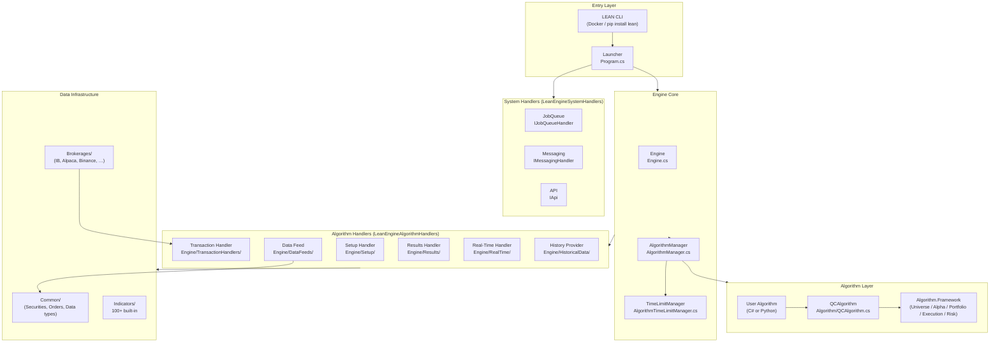
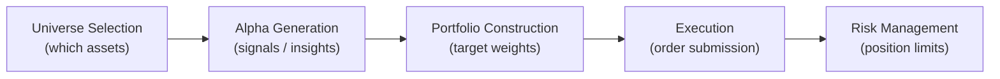
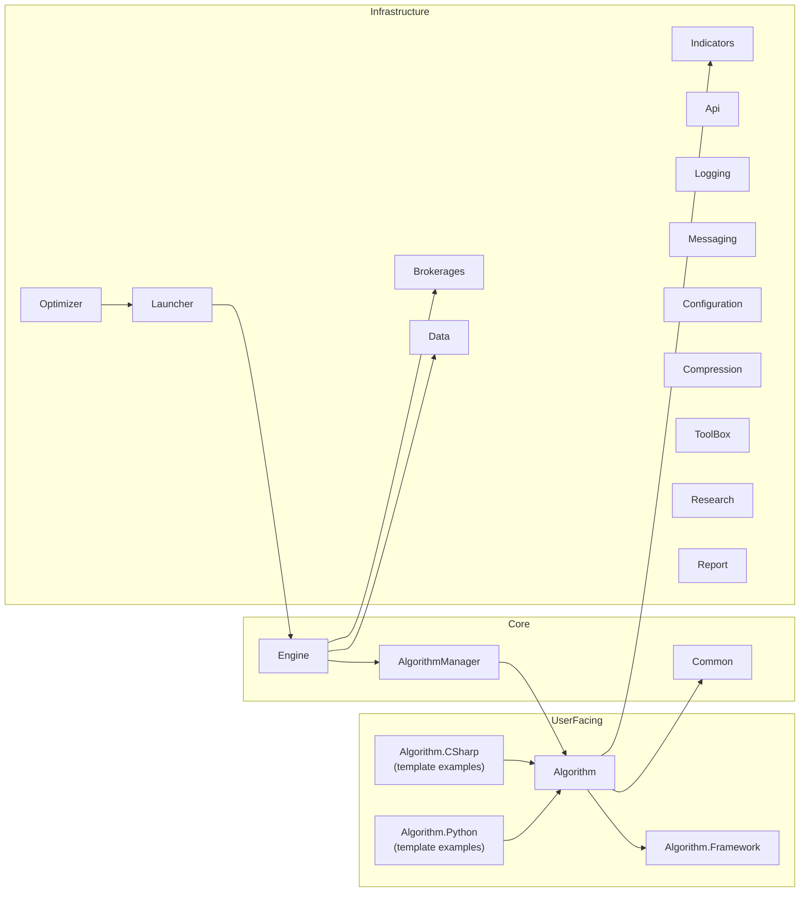

# LEAN — Architecture

## System Architecture

## Trading Paradigm & Key Features

| Dimension | Details |
|---|---|
| **Paradigm** | Event-driven, time-sliced; each time step fires `OnData` with a `Slice` of all subscribed assets |
| **Backtest Mode** | File-based data replay; deterministic ordering of data events |
| **Live Mode** | Brokerage data streams piped through same event loop; same algorithm code runs unchanged |
| **Asset Classes** | Equity, Equity Options, Futures, Futures Options, Forex, CFD, Crypto, Crypto Futures, Index, Index Options |
| **Languages** | C# (native), Python (via `AlgorithmFactory` + `pythonnet`) |
| **Concurrency** | Data feed threads → `DataFeedPacket` queue → single-threaded algorithm loop |
| **Modularity** | Every handler is an interface; swap implementations in `config.json` without code changes |
| **Framework** | Optional five-layer composable framework (Universe → Alpha → Portfolio → Execution → Risk) |

## Core Components

### 1. Engine (`Engine/Engine.cs`)

Entry point. Accepts `LeanEngineSystemHandlers` and `LeanEngineAlgorithmHandlers`, resolves the job from the job queue, instantiates the algorithm, and delegates the run loop to `AlgorithmManager`.

Source: [`Engine/Engine.cs`](../Engine/Engine.cs)

### 2. AlgorithmManager (`Engine/AlgorithmManager.cs`)

The main execution loop. Iterates over time slices produced by the data feed, dispatches market data events to the algorithm, enforces time limits, and coordinates order submission with the transaction handler.

Source: [`Engine/AlgorithmManager.cs`](../Engine/AlgorithmManager.cs)

### 3. QCAlgorithm (`Algorithm/QCAlgorithm.cs`)

The base class every user algorithm extends. Provides the full API surface: `AddEquity`, `AddFuture`, `SetHoldings`, `MarketOrder`, `LimitOrder`, `Schedule.On`, indicator factory methods, and hundreds of helpers.

Key source files:
- [`Algorithm/QCAlgorithm.cs`](../Algorithm/QCAlgorithm.cs) — core API
- [`Algorithm/QCAlgorithm.Trading.cs`](../Algorithm/QCAlgorithm.Trading.cs) — order placement
- [`Algorithm/QCAlgorithm.Indicators.cs`](../Algorithm/QCAlgorithm.Indicators.cs) — indicator helpers
- [`Algorithm/QCAlgorithm.History.cs`](../Algorithm/QCAlgorithm.History.cs) — historical data requests
- [`Algorithm/QCAlgorithm.Universe.cs`](../Algorithm/QCAlgorithm.Universe.cs) — universe management

### 4. Data Feeds (`Engine/DataFeeds/`)

Responsible for sourcing and aggregating market data. The `DataFeed` produces time-ordered `TimeSlice` objects. Pluggable via `IDataFeed`.

Key files:
- [`Engine/DataFeeds/AggregationManager.cs`](../Engine/DataFeeds/AggregationManager.cs)
- [`Engine/DataFeeds/BaseDataExchange.cs`](../Engine/DataFeeds/BaseDataExchange.cs)

### 5. Transaction Handlers (`Engine/TransactionHandlers/`)

Receives order requests from the algorithm, routes them to the brokerage (or simulates fills in backtesting), and emits `OrderEvent` objects back to the algorithm.

Key files:
- [`Engine/TransactionHandlers/BacktestingTransactionHandler.cs`](../Engine/TransactionHandlers/BacktestingTransactionHandler.cs)
- [`Engine/TransactionHandlers/BrokerageTransactionHandler.cs`](../Engine/TransactionHandlers/BrokerageTransactionHandler.cs)

### 6. Brokerages (`Brokerages/`)

Adapter layer implementing `IBrokerage`. Each brokerage provides live data streaming, order placement, and account state synchronization.

Source: [`Brokerages/Brokerage.cs`](../Brokerages/Brokerage.cs)

Supported brokerages (brokerage models in Common):
- [`Common/Brokerages/AlpacaBrokerageModel.cs`](../Common/Brokerages/AlpacaBrokerageModel.cs)
- [`Common/Brokerages/BinanceBrokerageModel.cs`](../Common/Brokerages/BinanceBrokerageModel.cs)
- [`Common/Brokerages/CoinbaseBrokerageModel.cs`](../Common/Brokerages/CoinbaseBrokerageModel.cs)
- [`Common/Brokerages/CharlesSchwabBrokerageModel.cs`](../Common/Brokerages/CharlesSchwabBrokerageModel.cs)

### 7. Algorithm Framework (`Algorithm.Framework/`)

Optional composable five-layer architecture:

Each layer is independently swappable. Pre-built models:
- Alpha: `EmaCrossAlphaModel`, `MacdAlphaModel`, `HistoricalReturnsAlphaModel`
- Portfolio: `EqualWeightingPortfolioConstructionModel`, `MeanVarianceOptimizationPortfolioConstructionModel`
- Risk: `MaximumDrawdownPercentPerSecurity`, `TrailingStopRiskManagementModel`

Source: [`Algorithm.Framework/`](../Algorithm.Framework/)

### 8. Indicators (`Indicators/`)

Over 100 indicators including SMA, EMA, MACD, RSI, Bollinger Bands, ATR, ADX, Ichimoku, and custom composites. All indicators implement `IIndicator<T>` and are registered with the algorithm's consolidator pipeline.

Source: [`Indicators/`](../Indicators/)

## Module Diagram

