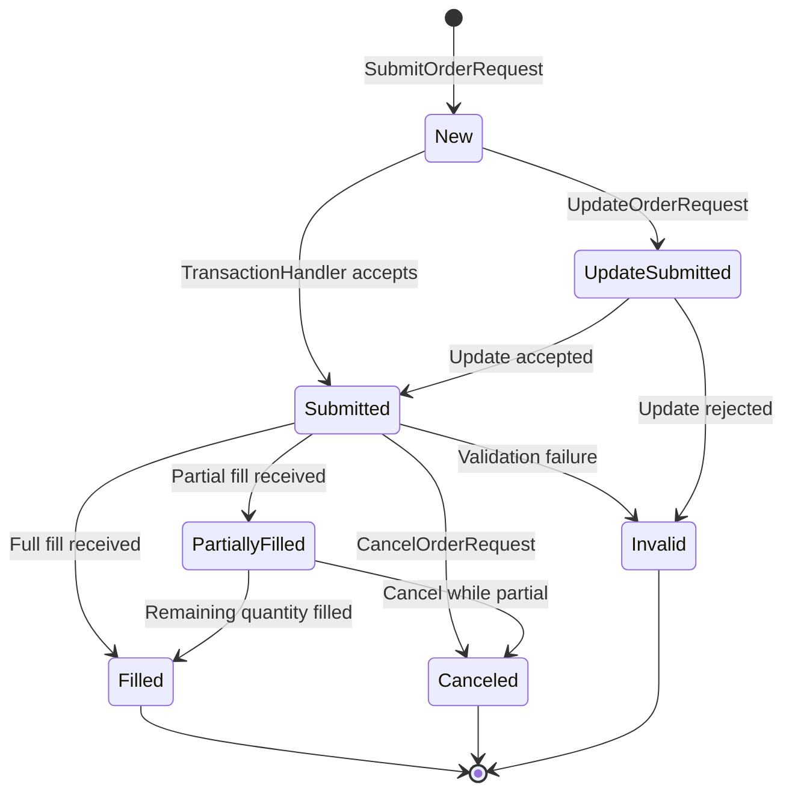

# LEAN — State Management

## Order State Machine

Every order in LEAN transitions through a well-defined set of states. The `Order` class is the canonical state carrier; `OrderEvent` objects record each transition.



### Order Types

Defined in [`Common/Orders/OrderTypes.cs`](../Common/Orders/OrderTypes.cs):

| Type | Class | Notes |
|---|---|---|
| `Market` | `MarketOrder` | Fills at next available price |
| `Limit` | `LimitOrder` | Fills only at limit price or better |
| `StopMarket` | `StopMarketOrder` | Market order triggered at stop price |
| `StopLimit` | `StopLimitOrder` | Limit order triggered at stop price |
| `MarketOnOpen` | `MarketOnOpenOrder` | Fills at opening auction |
| `MarketOnClose` | `MarketOnCloseOrder` | Fills at closing auction |
| `LimitIfTouched` | `LimitIfTouchedOrder` | Limit triggered when price touches level |
| `TrailingStop` | `TrailingStopOrder` | Stop price trails market |
| `OptionExercise` | `OptionExerciseOrder` | Manual or automatic option exercise |
| `ComboMarket` | `ComboMarketOrder` | Multi-leg combo at market |
| `ComboLimit` | `ComboLimitOrder` | Multi-leg combo at net limit |

Source: [`Common/Orders/`](../Common/Orders/)

### Order Ticket

When an order is submitted the algorithm receives an `OrderTicket` — a live handle to the order that allows updates and cancellations:

```csharp
var ticket = MarketOrder("SPY", 100);
ticket.Update(new UpdateOrderFields { Quantity = 150 });
ticket.Cancel();
var status = ticket.Status;       // OrderStatus enum
var avgPrice = ticket.AverageFillPrice;
```

Source: [`Common/Orders/OrderTicket.cs`](../Common/Orders/OrderTicket.cs)

### Time-In-Force

Orders can carry a `TimeInForce` policy:

| Policy | Behaviour |
|---|---|
| `GoodTilCanceled` | Default; persists until filled or cancelled |
| `Day` | Cancelled at end of trading session |
| `GoodTilDate` | Cancelled at specified date/time |

Source: [`Common/Orders/TimeInForce.cs`](../Common/Orders/TimeInForce.cs)

## Position Tracking

### SecurityHolding

Each subscribed security maintains a `SecurityHolding` object that tracks:

- `Quantity` — number of shares / contracts held (negative for short)
- `AveragePrice` — volume-weighted average entry price
- `UnrealizedProfit` / `UnrealizedProfitPercent`
- `RealizedProfit` (total lifetime PnL from closed trades)
- `TotalFees` — cumulative commission and fees paid

Source: [`Common/Securities/Equity/EquityHolding.cs`](../Common/Securities/Equity/EquityHolding.cs) (per-asset subclass); base in `Common/Securities/`.

### Portfolio State

`SecurityPortfolioManager` (accessed via `Algorithm.Portfolio`) aggregates all holdings:

```csharp
// Total portfolio equity
decimal equity = Portfolio.TotalPortfolioValue;

// Cash on hand
decimal cash = Portfolio.Cash;

// Per-symbol
var holding = Portfolio["SPY"];
bool invested = Portfolio.Invested;

// Margin
decimal marginUsed = Portfolio.TotalMarginUsed;
decimal marginRemaining = Portfolio.MarginRemaining;
```

Source: [`Common/Securities/SecurityPortfolioManager.cs`](../Common/Securities/SecurityPortfolioManager.cs)

### Buying Power Models

LEAN enforces buying power constraints before order submission. Models are asset-class specific:

| Model | Asset | Source |
|---|---|---|
| `SecurityMarginModel` | Equities (Reg T) | `Common/Securities/` |
| `BuyingPowerModel` | Base model | [`Common/Securities/BuyingPowerModel.cs`](../Common/Securities/BuyingPowerModel.cs) |
| `CashBuyingPowerModel` | Crypto (no margin) | [`Common/Securities/CashBuyingPowerModel.cs`](../Common/Securities/CashBuyingPowerModel.cs) |
| `FutureMarginModel` | Futures | `Common/Securities/Future/` |
| `OptionMarginModel` | Options | `Common/Securities/Option/` |

### Cash Book

The `CashBook` tracks multi-currency cash balances and handles automatic currency conversions using forex rates from the data feed.

Source: [`Common/Securities/CashBook.cs`](../Common/Securities/CashBook.cs)

## Portfolio Snapshot & Warm-Up

### Warm-Up

Algorithms may request a warm-up period to pre-populate indicators before the first `OnData` call:

```csharp
SetWarmUp(TimeSpan.FromDays(50));
// or
SetWarmUp(200, Resolution.Daily);
```

During warm-up, orders are not sent and `IsWarmingUp` returns `true`.

### Object Store

LEAN provides a key-value object store for persisting arbitrary state across restarts:

```csharp
ObjectStore.Save("my-state", JsonConvert.SerializeObject(myState));
var data = ObjectStore.Read("my-state");
```

Source: [`Engine/Storage/LocalObjectStore.cs`](../Engine/Storage/LocalObjectStore.cs)

## See Also

- [workflow.md](workflow.md) — Order submission sequence and event lifecycle
- [architecture.md](architecture.md) — Transaction handler and brokerage components
- [development.md](development.md) — Configuration for margin models and settlement
