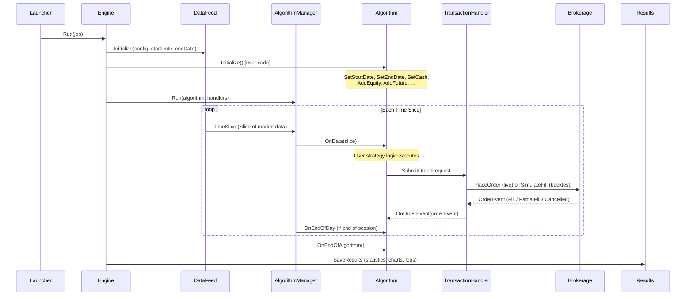
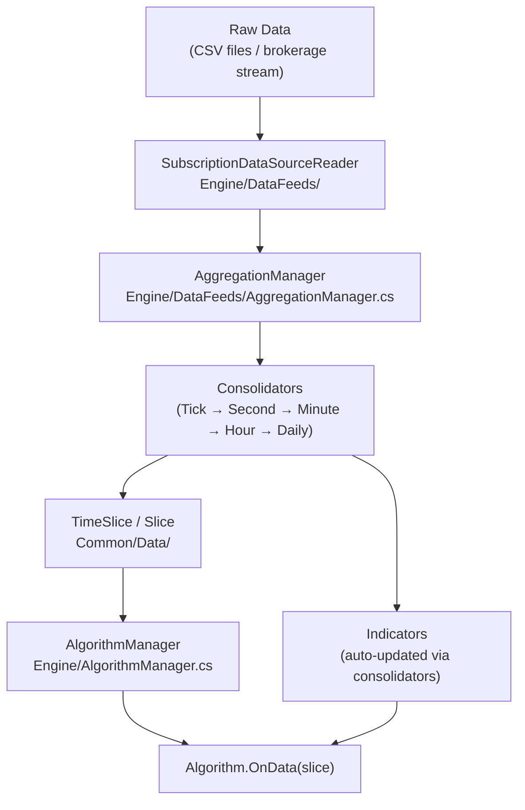

# LEAN — Workflow

## Algorithm Execution Pipeline

The LEAN engine follows a deterministic, event-driven pipeline. The same code path is used for both backtesting and live trading — only the data feed and transaction handler implementations differ.

## Data Flow

Market data enters LEAN through the data feed layer and is aggregated into time-sliced `Slice` objects before reaching user code.

### Resolution Pipeline

LEAN supports multiple data resolutions, each routed through a different consolidation path:

| Resolution | Description | Typical Use |
|---|---|---|
| `Tick` | Raw exchange ticks | HFT, intraday scalping |
| `Second` | 1-second OHLCV bars | Intraday strategies |
| `Minute` | 1-minute OHLCV bars | Default for equities/options |
| `Hour` | Hourly OHLCV bars | Swing trading |
| `Daily` | End-of-day OHLCV bars | Long-term strategies |

Consolidators aggregate finer-grained data into coarser resolutions on demand. Custom consolidators can produce arbitrary calendar-aligned or count-based bars.

## Event Lifecycle

### Initialization Phase

1. `Launcher` parses `config.json` and creates handlers.
2. `Engine` instantiates the algorithm via `AlgorithmFactory` (C# reflection or `pythonnet`).
3. `Algorithm.Initialize()` is called — the user registers assets, sets date range and cash, and attaches indicators.
4. The `Setup` handler seeds the portfolio with initial cash and holdings.
5. `DataFeed` begins producing time slices from the configured start date.

### Per-Slice Phase

For every time step the engine:

1. Delivers the `TimeSlice` to `AlgorithmManager`.
2. Updates security prices in `SecurityManager`.
3. Fires scheduled events (`Schedule.On`).
4. Calls `Algorithm.OnData(slice)` with the current market data.
5. Processes pending order requests via `TransactionHandler`.
6. Updates portfolio PnL, margin, and buying power.
7. Fires `Algorithm.OnOrderEvent` for each fill or status change.
8. Emits a results update (equity curve data point, logs).

### End-of-Day / End-of-Algorithm

- `Algorithm.OnEndOfDay(symbol)` fires at market close for each subscribed symbol.
- `Algorithm.OnEndOfAlgorithm()` fires once at the end of the run.
- The results handler writes the final statistics JSON, trade log, and charts.

## See Also

- [architecture.md](architecture.md) — Component overview and module diagram
- [state-management.md](state-management.md) — Order state machine and portfolio tracking
- [development.md](development.md) — Setup and configuration reference
